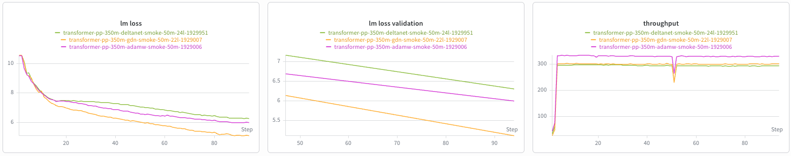
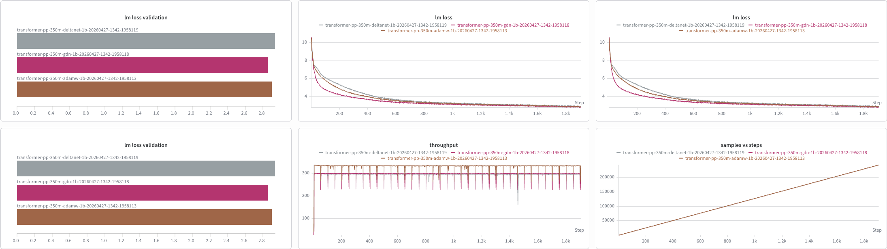
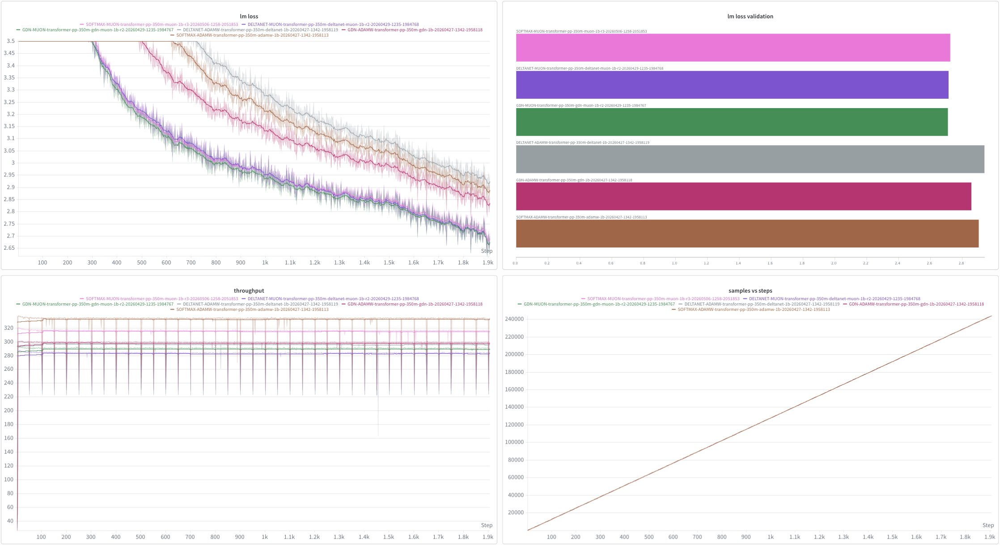

# Tommaso

## Week 1

**Goal**: Working Clariden pipeline for an initial architecture comparison.

### Main Experimental Choices
Choices taken to be coherent with the core Gated DeltaNet implementation.
- **Optimizer:** AdamW. Later, we will try Muon (Ling already did).
- **Dataset:** FineWeb-Edu. Incrementally increase the dataset size 50M (quick run) -> 15B (initial baseline) -> 100B (final baseline).
- **Tokenizer:** LLaMA-2 SentencePiece.
- **Cluster setting:** Clariden, one GH200 node with 4 GPUs, using pure
  data-parallel training with tensor, pipeline, and context parallelism all
  kept at 1.

### Clariden Validation Completed
The full path was validated on Clariden in the intended runtime environment:
- FineWeb-Edu quick conversion completed successfully (about **50M tokens**, 99% for training and 1% for validation).
- L (#layers) was kept fixed for the Transformer++ reference and adjusted for Gated DeltaNet and DeltaNet so that parameter counts stayed within about +/- 2% of the Transformer++ baseline.

The current quick-run comparison is:

| Baseline | Params | Optimizer | Data | Tokenizer | Final train loss | Final val loss | Val PPL | Throughput (TFLOP/s/GPU) | Throughput (ktokens/s/GPU, approx.) |
| --- | ---: | --- | --- | --- | ---: | ---: | ---: | ---: | ---: |
| Transformer++ softmax (24L) | 317.2M | AdamW | FineWeb-Edu 50M | LLaMA-2 | 5.9744 | 6.0082 | 406.8 | 331.0 | 171 |
| Gated DeltaNet (22L) | 313.4M | AdamW | FineWeb-Edu 50M | LLaMA-2 | 5.1020 | 5.1217 | 167.6 | 302.0 | 156 |
| DeltaNet (24L) | 319.5M | AdamW | FineWeb-Edu 50M | LLaMA-2 | 6.2663 | 6.3069 | 548.3 | 294.3 | 152 |

`lm loss` is the autoregressive cross-entropy / negative log-likelihood
averaged over predicted tokens, and perplexity is therefore `exp(loss)`.
The `ktokens/s/GPU` values are approximate for softmax and Gated DeltaNet. I
used the measured DeltaNet value (`152,136.8 tokens/s/GPU`) and scaled it by
the throughput ratios:
`tokens/s ≈ 152,136.8 * (throughput_model / 294.3)`, then rounded to the
nearest integer in `ktokens/s/GPU`.

The figure below shows the same three-way comparison visually: training loss,
validation loss, and throughput over the near-full 50M-token run.

Open full-size image: [clariden_baseline_comparison_2026-04-23.png](week1/clariden_baseline_comparison_2026-04-23.png)



Operationally, this establishes that:

- the data path works,
- the tokenizer path works,
- the Clariden sbatches work,
- all three baseline training pipelines run successfully on one GH200 node.

### Interpretation

The initial quick runs were operational and numerical checks rather than final
benchmark runs. Their purpose was to confirm that:

- the FineWeb-Edu data conversion is valid,
- the LLaMA-2 tokenizer is loaded correctly,
- the Megatron binary dataset is readable,
- the model builds successfully on Clariden,
- distributed training runs on 4 GH200 GPUs,
- validation executes correctly,
- W&B logging works,
- training remains numerically stable without NaNs.

At this stage, the main picture is:
- **Gated DeltaNet** is best on quality,
- **Transformer++ softmax** is best on raw throughput,
- **plain DeltaNet** is currently the weakest of the three and is most useful
  as an ungated ablation.

The plain DeltaNet result is important because it makes the role of gating
much clearer. In this setup, the gating in GDN is doing substantial work
rather than acting as a small implementation detail.

### Next Week

1. Launch longer runs (1B-tokens and 15B-tokens dataset versions of FineWeb-edu) for:
   - 350M Transformer++ + AdamW
   - 350M Gated DeltaNet + AdamW
   - 350M DeltaNet + AdamW
   - 350M Transformer++ + Muon
   - 350M Gated DeltaNet + Muon
   - 350M DeltaNet + Muon
2. Compare the longer runs on the same metrics as above (loss, perplexity, and throughput).  
3. Have a stable baseline comparison to start to integrate CLER.

### Note For Myself: Baseline Implementation Details

Not for discussion unless needed.

What I implemented:
- Added a FineWeb-Edu conversion path that:
  - streams the shuffled FineWeb-Edu source,
  - counts tokens with the LLaMA-2 tokenizer,
  - writes a deterministic JSONL prefix,
  - converts the result into Megatron binary format.
- Added and validated short quick-run sbatches for end-to-end runtime checks before longer runs.
- Updated the 350M Transformer++ AdamW launcher to use FineWeb-Edu and the LLaMA-2 tokenizer.
- Added a 350M Gated DeltaNet launcher under the same data, tokenizer, and optimizer setup, including the Flash Linear Attention runtime dependencies needed by the Megatron GDN path.
- Added a basic 350M plain DeltaNet launcher and module path as an ungated ablation under the same overall training recipe.
- Updated the Clariden / Alps launch path and dependency installation so the jobs run correctly in the containerized environment.

#### Transformer++ softmax

- launcher:
  [_research/launch/transformer-pp-350m-adamw.sbatch](../_research/launch/transformer-pp-350m-adamw.sbatch)
- no new attention module was added
- the work here was mostly configuration and runtime bring-up:
  - switch to FineWeb-Edu,
  - switch to LLaMA-2 tokenizer,
  - add Clariden quick-run / near-full launch settings,
  - keep AdamW fixed
- architecture stays on the standard Megatron / Transformer++ path with:
  - softmax self-attention,
  - Transformer Engine kernels,
  - RoPE,
  - grouped-query attention,
  - RMSNorm and SwiGLU

#### Gated DeltaNet

- module:
  [gated_delta_net.py](../megatron/core/ssm/gated_delta_net.py)
- launcher:
  [_research/launch/transformer-pp-350m-gdn.sbatch](../_research/launch/transformer-pp-350m-gdn.sbatch)
- Clariden work:
  - enable Flash Linear Attention dependencies in
    [install_python_deps.sh](../_research/launch/install_python_deps.sh)
  - add matching quick-run / near-full launchers
  - keep dataset, tokenizer, optimizer, batch size, and sequence length aligned with softmax
  - calibrate from 20 to 22 layers to get closer in size to the softmax run
- in this wrapper, GDN includes:
  - `--experimental-attention-variant gated_delta_net`
  - linear-attention layers inserted via `--linear-attention-freq 3`
  - short convolution preprocessing on `q`, `k`, and `v`
  - a learned delta-rule decay gate
  - a separate output gate after normalization

#### Plain DeltaNet

- module:
  [delta_net.py](../megatron/core/ssm/delta_net.py)
- wiring:
  [experimental_attention_variant_module_specs.py](../megatron/core/models/gpt/experimental_attention_variant_module_specs.py)
  and
  [transformer_config.py](../megatron/core/transformer/transformer_config.py)
- throughput accounting:
  [training.py](../megatron/training/training.py)
- launchers:
  [_research/launch/transformer-pp-350m-deltanet.sbatch](../_research/launch/transformer-pp-350m-deltanet.sbatch)
  and
  [_research/launch/transformer-pp-350m-deltanet-smoke.sbatch](../_research/launch/transformer-pp-350m-deltanet-smoke.sbatch)
- relative to GDN, plain DeltaNet:
  - uses `--experimental-attention-variant delta_net`
  - calls the plain Flash Linear Attention delta-rule kernel
  - removes the learned decay-gate path
  - removes the separate output gate after normalization
- I kept the surrounding training recipe aligned with GDN:
  - same FineWeb-Edu 50M dataset,
  - same LLaMA-2 tokenizer,
  - same AdamW optimizer,
  - same micro-batch size, global batch size, and sequence length,
  - same hybrid insertion frequency for linear-attention layers
- I also kept the short convolution and q/k normalization structure; because
  the plain DeltaNet wrapper uses the same head count for q/k and v, I adjusted
  the head layout to preserve the same overall q/k and value widths used in the
  GDN run

---
---

## Week 2

### Week 1 Recap

While revisiting the finished Clariden logs, I noticed that I had initially
mixed up the throughput units. The logs report both `tokens/s/GPU` and
`TFLOP/s/GPU`, and for runtime estimation the relevant quantity is
`tokens/s/GPU`, not `TFLOP/s/GPU`. More precisely:

- `tokens/s/GPU` comes from the local Apertus logging hook in
  [_research/logging_patch/hooks.py](../_research/logging_patch/hooks.py),
  where it is computed from wall-clock deltas between successive training-log
  calls;
- `TFLOP/s/GPU` comes from Megatron's own `--log-throughput` path in
  [megatron/training/training.py](../megatron/training/training.py).

The exact Week 1 recap from the final training-step log lines is:

| Baseline | Params | Final train loss | Final val loss | Val PPL | Throughput (ktokens/s/GPU) | Throughput (TFLOP/s/GPU) |
| --- | ---: | ---: | ---: | ---: | ---: | ---: |
| Transformer++ softmax (24L) | 317.2M | 5.9744 | 6.0082 | 406.8 | 143.3 | 331.0 |
| Gated DeltaNet (22L) | 313.4M | 5.1020 | 5.1217 | 167.6 | 161.4 | 302.0 |
| DeltaNet (24L) | 319.5M | 6.2663 | 6.3069 | 548.3 | 152.1 | 294.3 |

These values were read directly from the finished Clariden logs:

- `transformer-pp-350m-adamw-smoke-1929006.log`
- `transformer-pp-350m-gdn-smoke-1929007.log`
- `transformer-pp-350m-deltanet-smoke-1929951.log`

### Runtime Planning

I first tried scheduling the longer runs by reserving 12 hours for the
conversion step and 10 hours for each training step. In practice, the first
conversion job kept being postponed in the `normal` partition, so I estimated
the expected runtimes from the Week 1 quick-run measurements before
resubmitting.

The runtime planning reuses the same training setup as the 350M Transformer++
baseline launcher
[_research/launch/transformer-pp-350m-adamw.sbatch](../_research/launch/transformer-pp-350m-adamw.sbatch),
unless explicitly overridden in the Gated DeltaNet and DeltaNet launchers. In
particular, this means:

- micro-batch size = 16
- global batch size = 128
- sequence length = 4096
- tokens per iteration = `128 * 4096 = 524,288`
- data-parallel training on 4 GPUs with `TP=1`, `PP=1`, `CP=1`
- AdamW with `lr = 3e-4`, `min-lr = 3e-5`, WSD schedule, `bf16`
- FineWeb-Edu data and the LLaMA-2 SentencePiece tokenizer

This gives:

- `1B / 524,288 = 1907` iterations
- `15B / 524,288 = 28,610` iterations

Using the measured `tokens/s/GPU` values from the recap table above, the
approximate per-step times are:

- Transformer++ softmax: `~0.91 s/iter`
- Gated DeltaNet: `~0.81 s/iter`
- DeltaNet: `~0.86 s/iter`

This implies the following training-only runtimes:

| Baseline | 1B tokens | 15B tokens |
| --- | ---: | ---: |
| Transformer++ softmax | ~29.1 min | ~7.3 h |
| Gated DeltaNet | ~25.8 min | ~6.5 h |
| DeltaNet | ~27.4 min | ~6.9 h |

From these estimates, the practical conclusion is:

- `1B` conversion should be resubmitted separately with a shorter walltime
  target (`6h`) to improve schedulability;
- `1B` training jobs should fit comfortably within `2h`;
- `15B` training jobs should be kept around `8h`;
- the `15B` conversion should be launched only after the `1B` stage is
  complete, instead of queueing the entire `1B -> 15B` chain at once.

One operational detail that became clear during resubmission is that the
FineWeb-Edu dataset is not stored locally on Clariden as a ready-made training
prefix. The conversion job streams the raw FineWeb-Edu source from Hugging Face,
counts tokens with the LLaMA-2 tokenizer, writes a deterministic local JSONL
prefix, and only then converts that local prefix into Megatron `.bin` / `.idx`
files. In practice, the existence check is therefore not testing whether the
raw dataset exists on the cluster, but whether the converted local Megatron
prefix already exists at the expected scratch path.

### 1B Clariden Results

The final `1B` comparison now includes both the original AdamW runs and the
follow-up Muon runs on the same FineWeb-Edu + LLaMA-2 setup. For the hybrid
architectures, the Muon numbers below come from the corrected reruns with the
same layer counts as the AdamW baselines (`22L` for GDN and `24L` for
DeltaNet), so the comparison is optimizer-only.

| Baseline | Optimizer | Final train loss | Final val loss | Val PPL | Throughput (ktokens/s/GPU) | Throughput (TFLOP/s/GPU) | Elapsed |
| --- | --- | ---: | ---: | ---: | ---: | ---: | ---: |
| Transformer++ softmax | AdamW | 2.9111 | 2.9019 | 18.2095 | 144.8 | 334.6 | 00:31:30 |
| Transformer++ softmax | Muon | 2.7141 | 2.7239 | 15.2397 | 136.6 | 315.7 | 00:47:31 |
| Gated DeltaNet | AdamW | 2.8587 | 2.8562 | 17.3950 | 159.5 | 298.6 | 00:27:47 |
| Gated DeltaNet | Muon | 2.6965 | 2.7097 | 15.0254 | 154.8 | 289.6 | 00:28:44 |
| DeltaNet | AdamW | 2.9484 | 2.9391 | 18.8987 | 153.4 | 296.8 | 00:28:45 |
| DeltaNet | Muon | 2.6990 | 2.7137 | 15.0847 | 146.7 | 283.7 | 00:30:00 |

Full W&B workspace:
[megatron-lm-research-baseline](https://wandb.ai/tommasocerruti-eth-z-rich/megatron-lm-research-baseline?nw=nwusertommasocerruti)

Open full-size image:
[clariden_1b_baseline_comparison_2026-04-28.png](week2/clariden_1b_baseline_comparison_2026-04-28.png)



## Week 3

### 1B Clariden Results (updated)

The final `1B` comparison now includes both the original AdamW runs and the
finalized Muon reruns on the same FineWeb-Edu + LLaMA-2 setup. The Muon rows
below come from the finalized `24L` Transformer++, `22L` GDN, and `24L`
DeltaNet reruns, so the comparison is optimizer-only.

| Baseline | Optimizer | Final train loss | Final val loss | Val PPL | Throughput (ktokens/s/GPU) | Throughput (TFLOP/s/GPU) | Elapsed |
| --- | --- | ---: | ---: | ---: | ---: | ---: | ---: |
| Transformer++ softmax | AdamW | 2.9111 | 2.9019 | 18.2095 | 144.8 | 334.6 | 00:31:30 |
| Transformer++ softmax | Muon | 2.7134 | 2.7240 | 15.2410 | 136.7 | 316.0 | 00:32:22 |
| Gated DeltaNet | AdamW | 2.8587 | 2.8562 | 17.3950 | 159.5 | 298.6 | 00:27:47 |
| Gated DeltaNet | Muon | 2.6965 | 2.7097 | 15.0254 | 154.8 | 289.6 | 00:28:44 |
| DeltaNet | AdamW | 2.9484 | 2.9391 | 18.8987 | 153.4 | 296.8 | 00:28:45 |
| DeltaNet | Muon | 2.6990 | 2.7137 | 15.0847 | 146.7 | 283.7 | 00:30:00 |

Full W&B workspace:
[megatron-lm-research-baseline](https://wandb.ai/tommasocerruti-eth-z-rich/megatron-lm-research-baseline?nw=nwusertommasocerruti)

Open full-size image:
[clariden_1b_baseline_comparison_2026-04-28.png](week3/clariden_1b_baseline_comparison_2026-05-07.png)



## Week 4

Ran the full zero-shot `lm_eval` suite on the three 350M native Megatron
checkpoints from the `20260507-1855` 1B-token family:

- Transformer++ / FineWeb Muon
- GDN Muon
- DeltaNet Muon

The three tasks test different commonsense abilities:

- **HellaSwag**: choose the most plausible ending to a short scenario.
- **PIQA**: choose the better answer for a physical-interaction question.
- **WinoGrande**: resolve an ambiguous pronoun using commonsense context.

I evaluated the native Megatron checkpoints directly, without HF conversion. The
setup used `lm_eval` with the local static Megatron text-generation server,
remote tokenizer endpoints, and loglikelihood scoring through
`local-completions`:

```bash
SERVER_IMPL=static
SERVER_EXTRA_ARGS="--transformer-impl local --attention-backend unfused --no-persist-layer-norm"
TASKS="hellaswag,piqa,winogrande"
LIMIT unset
```

All three runs loaded checkpoint iteration `1907` and completed the full eval
end to end.

| Model | HellaSwag acc_norm | PIQA acc_norm | WinoGrande acc |
| --- | ---: | ---: | ---: |
| Transformer++ | 0.2584 | 0.5087 | 0.4980 |
| GDN | 0.2576 | 0.5103 | 0.4925 |
| DeltaNet | 0.2538 | 0.4973 | 0.4862 |

Here `acc` is the raw multiple-choice accuracy from plain continuation
loglikelihood scoring. `acc_norm` uses length-normalized continuation scores,
which helps reduce the model's bias toward shorter answer options, so it is
usually the more informative metric on tasks like HellaSwag and PIQA. I report
WinoGrande with plain `acc` because that is the primary metric emitted by this
harness run.

The result JSONs and logs live under:

- [`_research/results/eval/transformer-pp-350m-fineweb-muon-1b-lm-eval-full-3tasks/`](../_research/results/eval/transformer-pp-350m-fineweb-muon-1b-lm-eval-full-3tasks/)
- [`_research/results/eval/transformer-pp-350m-gdn-muon-1b-lm-eval-full-3tasks/`](../_research/results/eval/transformer-pp-350m-gdn-muon-1b-lm-eval-full-3tasks/)
- [`_research/results/eval/transformer-pp-350m-deltanet-muon-1b-lm-eval-full-3tasks/`](../_research/results/eval/transformer-pp-350m-deltanet-muon-1b-lm-eval-full-3tasks/)

Short read: the models are very close at this scale and training point. GDN is
slightly ahead on PIQA, Transformer++ is slightly ahead on HellaSwag and
WinoGrande, and DeltaNet is slightly lower across the three tasks. The gaps are
small, so I would not claim a decisive quality difference from this eval alone.
The main result is that the native-Megatron `lm_eval` path now works end to end
for all three implementations.

Update: a later log audit found that the GDN and DeltaNet eval servers were
starting with `experimental_attention_variant=None` and
`linear_attention_freq=None`. That means the non-Transformer++ rows above should
be treated as superseded until rerun with the experimental-attention checkpoint
args restored correctly. The Transformer++ row is not affected by this issue.

## Week 5

Evaluated larger native Megatron DeltaNet Muon checkpoints from Tim's
checkpoint folder with the same native `lm_eval` path as before: static local
text-generation server, local transformer implementation, unfused attention, no
persistent layer norm, and remote tokenizer endpoints. No HF conversion was
used.

The useful 1.3B result is now the fixed checkpoint root
`transformer-pp-1.3b-deltanet-muon-33f00b09a-2368145`, whose latest checkpoint
is iteration `19073`. Tim's progress log shows the run had reached about
`39.64B` tokens at iteration `18900`, so this is a proper late checkpoint rather
than the earlier smoke checkpoint. For 3B, I only found the early checkpoint at
iteration `50`; the later/final 3B checkpoint was not available in the readable
checkpoint folders when I checked.

| Model | Checkpoint iter | HellaSwag acc_norm | PIQA acc_norm | WinoGrande acc |
| --- | ---: | ---: | ---: | ---: |
| DeltaNet 1.3B Muon | 19073 | 0.2541 | 0.4989 | 0.5264 |
| DeltaNet 3B Muon | 50 | 0.2612 | 0.5027 | 0.5091 |

Short read: the final-ish 1.3B checkpoint loads and runs correctly through the
native-Megatron `lm_eval` harness. Compared with the earlier iteration-50
sanity check, the clearest movement is WinoGrande, which rises to `0.5264`.
HellaSwag and PIQA are still close to chance, so I would not over-interpret
these downstream numbers yet. The 3B row is kept only as an early-checkpoint
reference until a real later 3B checkpoint is available.

Update: these DeltaNet rows are also superseded. Their server logs show
`experimental_attention_variant=None`, so the eval server was not actually
building the DeltaNet attention stack from the checkpoint. They need to be rerun
after the native checkpoint-arg loading fix.

### FineWeb-Edu perplexity eval

The downstream multiple-choice tasks are noisy for these checkpoints, so I also
added a closer-to-training-distribution `lm_eval` path for FineWeb-Edu
perplexity. This uses Tim's corrected 15B-token FineWeb-Edu JSONL:

```bash
/iopsstor/scratch/cscs/tr1eder/cler/_research/results/data/fineweb_edu/fineweb_edu_15b_llama2_tc/fineweb_edu_15b_llama2_tc.jsonl
```

The eval does not score the full 66GB training prefix directly. It prepares a
deterministic 10k-document slice from the last 1% of the JSONL, matching the
spirit of the Megatron `--split 99,1,0` validation split, and then runs
`loglikelihood_rolling` with:

- `word_perplexity`
- `byte_perplexity`
- `bits_per_byte`

Smoke command for a native Megatron checkpoint:

```bash
CKPT=/path/to/native/megatron/checkpoint \
LLAMA2_TOKENIZER_MODEL=/iopsstor/scratch/cscs/course_00206/llama2-tokenizer/tokenizer.model \
RUN_NAME=my-run-fineweb-edu-smoke10 \
LIMIT=10 \
_research/eval/submit_lm_eval_fineweb_edu.sh
```

For a full slice eval, set `FINEWEB_FULL=1`, use the normal partition, and give
the job a longer time limit. This should be more sensitive to actual
training/validation-loss improvements than HellaSwag, PIQA, or WinoGrande.

Initial `LIMIT=10` smoke on the final 1.3B DeltaNet checkpoint completed, but
this number is now only a debugging artifact because the server was missing the
DeltaNet attention variant:

| Checkpoint | bits/byte | byte perplexity | word perplexity |
| --- | ---: | ---: | ---: |
| DeltaNet 1.3B Muon, iter 19073 | 6.7477 | 107.46 | 1.06e13 |

This smoke does not validate model quality. It was useful because the very poor
byte-level result led to the server-log audit below.

I also checked the downstream `lm_eval` samples, the API calibration probes, and
the server logs. The completion logprob contract itself is behaving sensibly:
scores are not constant, predictions are not stuck on one label, and simple
probes prefer `Paris` over `banana`, `Rome` over `spoon`, etc. But the server
logs exposed the real issue with the DeltaNet/GDN evals: the local experimental
attention settings were not restored by `--use-checkpoint-args`. The fix is to
load these architecture-defining fields from the native checkpoint args:

- `experimental_attention_variant`
- `linear_attention_freq`
- `linear_conv_kernel_dim`
- `linear_key_head_dim`
- `linear_value_head_dim`
- `linear_num_key_heads`
- `linear_num_value_heads`
- `attention_output_gate`

I also found two FineWeb rolling-eval details to harden before using this for
final comparisons:

- preserve BOS/EOS pieces in `/detokenize`, so rolling perplexity keeps the
  one-token prefix aligned with `lm_eval`'s `ctxlen=1` slicing;
- pass `LM_EVAL_MAX_LENGTH=4096` for FineWeb-Edu, so long documents use the
  same context length as the Megatron server instead of `lm_eval`'s 2048
  default.

After adding that checkpoint-arg fix, a tiny DeltaNet smoke confirmed the next
blocker:

- with `--transformer-impl local`, the correct DeltaNet block refuses to build
  because the experimental block spec currently requires Transformer Engine;
- with `--transformer-impl transformer_engine`, the checkpoint loads with
  `experimental_attention_variant=delta_net` and `linear_attention_freq=3`, but
  the first completion request fails inside `megatron/core/ssm/delta_net.py`
  with `NotImplementedError: DeltaNet does not support inference for now.`

So the previous random-looking DeltaNet/GDN downstream numbers should not be
used. The proper next step is either to implement static inference support for
the DeltaRule modules, or to add a direct full-forward loglikelihood scorer that
does not use Megatron's autoregressive inference context.

I implemented the second path: a scoring-only local server that computes
continuation loglikelihoods with full forward passes instead of Megatron's
autoregressive inference context. This supports DeltaNet and GDN checkpoints
with the architecture args restored from the native checkpoint.

The first pass below is only a `LIMIT=100` sanity sweep, so it should not be
treated as final benchmark quality. It is useful because it shows that the fixed
path is no longer random-looking, restores hybrid vs pure DeltaRule correctly,
and gives a clear scale-up signal for the larger DeltaNet checkpoints. The
training-token counts come from the checkpoint progress logs: the 350M matrix is
15B tokens, the 1.3B checkpoint is about 40B tokens, and the 3B checkpoint is
about 60B tokens.

| Size | Architecture | Variant | Optimizer | Iteration | Train tokens | HellaSwag acc | HellaSwag acc_norm | PIQA acc | PIQA acc_norm | WinoGrande acc |
| --- | --- | --- | --- | ---: | ---: | ---: | ---: | ---: | ---: | ---: |
| 350M | GDN | hybrid | Muon | 28610 | 15.0B | 0.3700 | 0.4700 | 0.6800 | 0.7000 | 0.5800 |
| 350M | GDN | pure DeltaRule | Muon | 28610 | 15.0B | 0.4100 | 0.4800 | 0.6900 | 0.7200 | 0.5800 |
| 350M | DeltaNet | hybrid | Muon | 28610 | 15.0B | 0.4200 | 0.4900 | 0.7000 | 0.7200 | 0.6100 |
| 350M | DeltaNet | pure DeltaRule | Muon | 28610 | 15.0B | 0.3900 | 0.4600 | 0.6700 | 0.7100 | 0.5600 |
| 350M | GDN | hybrid | AdamW | 28610 | 15.0B | 0.4000 | 0.4500 | 0.6300 | 0.6600 | 0.5200 |
| 350M | GDN | pure DeltaRule | AdamW | 28610 | 15.0B | 0.3600 | 0.4300 | 0.6700 | 0.6700 | 0.5900 |
| 350M | DeltaNet | hybrid | AdamW | 28610 | 15.0B | 0.3800 | 0.4700 | 0.6700 | 0.6600 | 0.6200 |
| 350M | DeltaNet | pure DeltaRule | AdamW | 28610 | 15.0B | 0.3900 | 0.4400 | 0.6700 | 0.6700 | 0.5000 |
| 1.3B | DeltaNet | hybrid | Muon | 19073 | 40.0B | 0.4500 | 0.5300 | 0.7300 | 0.7600 | 0.5900 |
| 3B | DeltaNet | hybrid | Muon | 7152 | 60.0B | 0.5100 | 0.6100 | 0.7200 | 0.7500 | 0.6300 |

Short read from the provisional probes: the corrected scoring path now shows a
real size signal, with 3B DeltaNet clearly above the 350M rows and the 1.3B row
in between. On the 350M slice, Muon generally looks better than AdamW on PIQA,
and hybrid DeltaNet looks better than pure DeltaRule on HellaSwag/WinoGrande.
The full 3-task runs are queued and should replace this table once they finish.

Full 3-task scoring results are now available for the full 350M matrix, the
1.3B/3B DeltaNet runs, two 1.3B CLER-DeltaNet checkpoints, and the matching
1.3B pure DeltaNet no-CLER comparator. These are the rows to use instead of the
`LIMIT=100` probe above.

| Size | Architecture | Variant | Optimizer | Iteration | Train tokens | HellaSwag acc | HellaSwag acc_norm | PIQA acc | PIQA acc_norm | WinoGrande acc |
| --- | --- | --- | --- | ---: | ---: | ---: | ---: | ---: | ---: | ---: |
| 350M | GDN | hybrid | Muon | 28610 | 15.0B | 0.3480 | 0.4158 | 0.6676 | 0.6741 | 0.5414 |
| 350M | GDN | pure DeltaRule | Muon | 28610 | 15.0B | 0.3337 | 0.3978 | 0.6763 | 0.6741 | 0.4870 |
| 350M | DeltaNet | hybrid | Muon | 28610 | 15.0B | 0.3541 | 0.4305 | 0.6681 | 0.6779 | 0.5051 |
| 350M | DeltaNet | pure DeltaRule | Muon | 28610 | 15.0B | 0.3426 | 0.4133 | 0.6741 | 0.6801 | 0.5170 |
| 350M | GDN | hybrid | AdamW | 28610 | 15.0B | 0.3369 | 0.3992 | 0.6616 | 0.6616 | 0.5099 |
| 350M | GDN | pure DeltaRule | AdamW | 28610 | 15.0B | 0.3265 | 0.3817 | 0.6561 | 0.6572 | 0.5217 |
| 350M | DeltaNet | hybrid | AdamW | 28610 | 15.0B | 0.3361 | 0.3987 | 0.6654 | 0.6513 | 0.5249 |
| 350M | DeltaNet | pure DeltaRule | AdamW | 28610 | 15.0B | 0.3293 | 0.3918 | 0.6480 | 0.6551 | 0.5154 |
| 1.3B | DeltaNet | hybrid | Muon | 19073 | 40.0B | 0.4277 | 0.5484 | 0.7209 | 0.7301 | 0.5572 |
| 1.3B | DeltaNet | pure DeltaRule, no CLER | Muon | 19073 | 40.0B | 0.4119 | 0.5234 | 0.7106 | 0.7193 | 0.5612 |
| 1.3B | CLER-DeltaNet | pure DeltaRule, gamma=0.1 | Muon | 19073 | 40.0B | 0.4049 | 0.5231 | 0.7089 | 0.7203 | 0.5446 |
| 1.3B | CLER-DeltaNet | pure DeltaRule, gamma=0.0 | Muon | 19073 | 40.0B | 0.4078 | 0.5220 | 0.7095 | 0.7160 | 0.5627 |
| 3B | DeltaNet | hybrid | Muon | 7152 | 60.0B | 0.4617 | 0.6063 | 0.7334 | 0.7410 | 0.5848 |

Short read from the full rows: the corrected scorer gives a much clearer signal
than the old static-server path. At 350M, Muon is consistently ahead of AdamW on
HellaSwag acc_norm and PIQA acc_norm. Hybrid DeltaNet is the strongest 350M row
on HellaSwag, while pure DeltaRule DeltaNet is slightly best on PIQA. The 1.3B
and 3B DeltaNet checkpoints show a clear scale-up gain over the 350M rows, with
3B strongest overall on all three tasks. The isolated 1.3B pure DeltaRule
comparison shows no clear downstream-task gain from CLER: gamma=0.1 is
essentially tied on HellaSwag acc_norm and slightly higher on PIQA acc_norm, but
lower on WinoGrande; gamma=0.0 is slightly higher on WinoGrande, but lower on
HellaSwag acc_norm and PIQA acc_norm. The effects are small and mixed.
